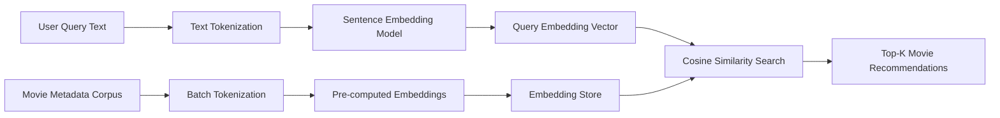
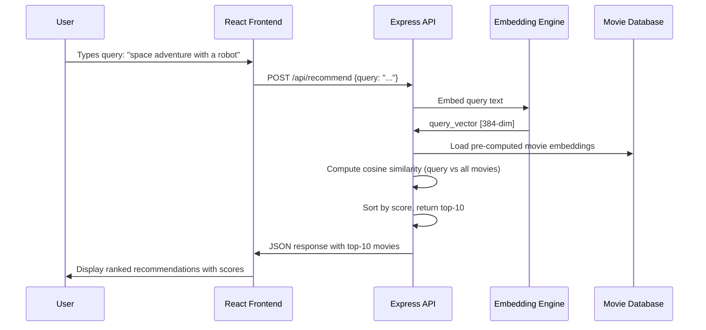
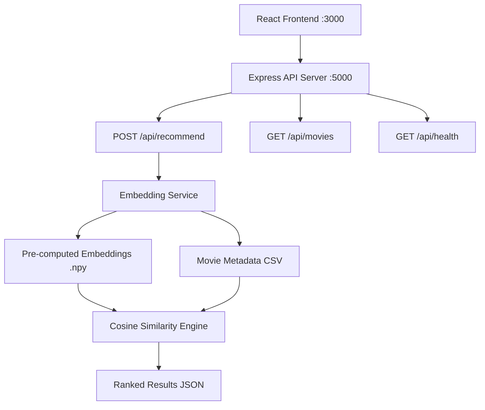

# 🎬 Semantic Movie Recommendation Engine

[](https://python.org)
[]()
[](https://reactjs.org)
[](https://nodejs.org)
[](LICENSE)

> A semantic search-based movie recommendation system that understands the **meaning** behind your query rather than just matching keywords. Powered by sentence embeddings and cosine similarity over a large movie metadata corpus.

---

## 📋 Table of Contents

- [Overview](#overview)
- [NLP Pipeline](#nlp-pipeline)
- [Semantic Search](#semantic-search)
- [Sentence Embeddings](#sentence-embeddings)
- [Cosine Similarity](#cosine-similarity)
- [Recommendation Workflow](#recommendation-workflow)
- [API Architecture](#api-architecture)
- [Project Structure](#project-structure)
- [Setup & Installation](#setup--installation)
- [Future Scope](#future-scope)
- [Roadmap](#roadmap)
- [Technologies Used](#technologies-used)

---

## 🔍 Overview

Traditional movie recommenders rely on collaborative filtering (user-item interactions) or keyword matching. This system uses **Natural Language Processing** to understand the semantic content of movie descriptions, making it possible to find relevant movies even when the query doesn't match any exact keywords in the dataset.

**Example**: Query `"a film about redemption in prison"` returns *The Shawshank Redemption* — without any keyword overlap.

---

## 🔤 NLP Pipeline



**Pipeline Steps:**
1. **Tokenization** — Text is cleaned, lowercased, and tokenized
2. **Embedding Generation** — Sentence-level embeddings capture semantic meaning
3. **Vector Storage** — Pre-computed embeddings stored as NumPy arrays for fast retrieval
4. **Similarity Search** — Cosine similarity computed between query and all stored vectors
5. **Ranking** — Movies sorted by similarity score; top-K returned

---

## 🧠 Semantic Search

Unlike keyword search (which requires exact term matches), semantic search:
- Understands **synonyms** and **paraphrases**
- Captures **thematic** and **conceptual** similarity
- Works across **multiple languages** (with multilingual models)
- Handles **vague, natural language** queries effectively

This makes it especially powerful for entertainment recommendation where users often don't know the exact movie title but remember the theme or plot.

---

## 📐 Sentence Embeddings

Sentence embeddings transform text into dense numerical vectors in a high-dimensional semantic space where:
- **Similar meanings → nearby vectors**
- **Dissimilar meanings → distant vectors**

The embedding model processes the concatenation of a movie's title, genre, and plot summary into a single fixed-length vector representation.

```
"A heist thriller set in Paris" 
           ↓ embedding model
[0.23, -0.81, 0.44, 0.12, ... , 0.67]  ← 384-dim vector
```

---

## 📏 Cosine Similarity

Cosine similarity measures the angle between two vectors, regardless of their magnitude:

$$\text{similarity}(A, B) = \frac{A \cdot B}{\|A\| \cdot \|B\|}$$

- Score of **1.0** = identical semantic meaning
- Score of **0.0** = completely unrelated
- Score of **-1.0** = opposite meaning

This metric is preferred over Euclidean distance for text embeddings because it is magnitude-invariant.

---

## 🎯 Recommendation Workflow



---

## 🏗️ API Architecture



### API Endpoints

| Method | Endpoint | Description |
|--------|----------|-------------|
| `POST` | `/api/recommend` | Get movie recommendations from text query |
| `GET` | `/api/movies` | List all movies in the corpus |
| `GET` | `/api/health` | Health check endpoint |

---

## 📁 Project Structure

```
Semantic-Movie-Recommendation/
├── README.md
├── requirements.txt
├── frontend/
│   ├── package.json
│   ├── public/
│   └── src/
│       ├── App.jsx               # Main React application
│       ├── components/
│       │   ├── SearchBar.jsx     # Query input component
│       │   └── MovieCard.jsx     # Result display component
│       └── index.js
├── backend/
│   ├── package.json
│   ├── server.js                 # Express server entry point
│   ├── routes/
│   │   └── recommendations.js   # Recommendation API route
│   └── services/
│       └── embedding_service.py # Python embedding service
├── embeddings/
│   └── (pre-computed .npy files — add after running generate_embeddings.py)
├── screenshots/
│   └── (UI screenshots)
└── docs/
    └── architecture.md
```

---

## 🚀 Setup & Installation

### Backend (Python embedding service)
```bash
git clone https://github.com/umeshpandeysh/Semantic-Movie-Recommendation.git
cd Semantic-Movie-Recommendation

python -m venv venv
venv\Scripts\activate
pip install -r requirements.txt
```

### Backend (Node.js API server)
```bash
cd backend
npm install
node server.js
```

### Frontend (React)
```bash
cd frontend
npm install
npm start
```

Open [http://localhost:3000](http://localhost:3000) in your browser.

---

## 🔭 Future Scope

- [ ] Hybrid recommender: combine semantic search with collaborative filtering
- [ ] Add user preference history and session-based personalisation
- [ ] Deploy embedding service with FastAPI for production performance
- [ ] Add multilingual query support
- [ ] Integrate TMDB API for live movie metadata and posters
- [ ] Add genre/year/rating filters alongside semantic search

---

## 🗺️ Roadmap

| Phase | Status | Description |
|-------|--------|-------------|
| Phase 1: NLP Pipeline | ✅ Complete | Tokenization, embedding, cosine similarity |
| Phase 2: API Server | ✅ Complete | Express REST API with recommendation endpoint |
| Phase 3: React Frontend | ✅ Complete | Search UI with result cards |
| Phase 4: Performance | 🔄 In Progress | FAISS indexing for large-scale retrieval |
| Phase 5: Deployment | 📋 Planned | Dockerized deployment to cloud |

---

## 🛠️ Technologies Used

| Category | Tools |
|----------|-------|
| **Language (Backend)** | Python 3.10+, Node.js 18+ |
| **Language (Frontend)** | JavaScript (React 18) |
| **NLP** | Sentence Transformers, Cosine Similarity |
| **Data** | NumPy, Pandas |
| **API** | Express.js, REST |
| **Frontend** | React, Axios |

---

## 📄 License

MIT License — see [LICENSE](LICENSE) for details.

---

<div align="center">

**Semantic Movie Recommendation** | Built by [Umesh Pandey](https://github.com/umeshpandeysh)

</div>
